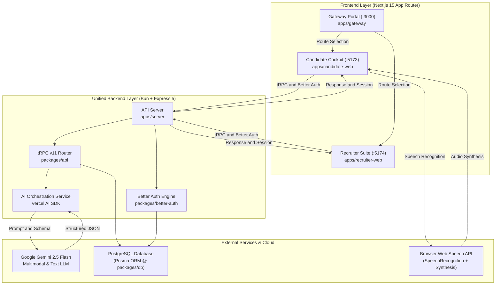

# System Architecture

## High-Level Architecture Overview

**Interview.AI** is built as a high-performance **TypeScript Monorepo** managed with Bun workspaces. It unites three specialized Next.js frontends with a unified backend server and shared domain packages.

---

## Architectural Principles

1. **End-to-End Type Safety**: Using tRPC v11 and Zod (`packages/api` & `packages/types`), frontends consume backend procedures with complete compile-time type inference. Any API schema change instantly surfaces type errors across both frontends.
2. **Unified Core Engine**: The single backend (`apps/server`) eliminates duplicative logic. Both candidate and recruiter features access a unified PostgreSQL database via Prisma, authenticated by Better Auth.
3. **Structured AI Outputs**: All interactions with Google Gemini 2.5 Flash utilize Vercel AI SDK (`ai` and `@ai-sdk/google`) with strict Zod schema validation (`Output.object`), ensuring predictable, JSON-parsable responses without hallucinated schemas.
4. **Shared Component Primitives**: `@interview.ai/ui` centralizes design tokens and accessible Radix UI primitives following the modern Vercel design language outlined in `DESIGN.md`.

---

## System Topology & Communication

### 1. Client-to-Server Communication
- **tRPC over HTTP (`/trpc/*`)**: All application queries and mutations (fetching jobs, submitting answers, starting interviews, retrieving AI reports) flow through tRPC batch requests.
- **Better Auth Endpoints (`/api/auth/*`)**: All authentication requests (sign-up, sign-in, session validation, OAuth callback) are handled by Better Auth handlers mounted directly into Express via `toNodeHandler(auth)`.
- **CORS & Security**: Configured in Express using `cors`, `helmet`, and `cookie-parser`, enabling secure credentialed cookies across `localhost:3000`, `localhost:5173`, `localhost:5174`, and production domains.

### 2. Browser Speech Pipeline
- **Speech Recognition (`webkitSpeechRecognition` / `SpeechRecognition`)**: Captures candidate vocal responses in real time in `candidate-web`, streaming interim and final transcripts into state.
- **Speech Synthesis (`window.speechSynthesis`)**: Renders AI interviewer question prompts into vocal speech in the candidate cockpit.
- **Video Avatar Synchronization**: An MP4 avatar loop provides visual feedback synchronized with interview audio playback.

### 3. AI Pipeline
- **Model**: `gemini-2.5-flash` via `@ai-sdk/google`.
- **Multimodal PDF Parsing**: Candidate resumes (PDF buffer) are directly passed as media buffers to Gemini for automated extraction into structured JSON (`ResumeAnalysisSchema`).
- **Dynamic Question Synthesis**: Generates targeted, 5-stage progressive interview curriculums based on candidate resume data or recruiter job specifications.
- **Evaluation Engine**: Analyzes complete transcripts across correctness, communication clarity, and confidence to produce quantitative scores and qualitative diagnostic feedback.

---

## Technology Matrix

| Layer | Technology | Purpose |
| :--- | :--- | :--- |
| **Workspace / Package Manager** | Bun Workspaces | Monorepo package resolution, fast scripting, and dependencies |
| **Backend Runtime** | Bun & Node.js | Execution environment for Express server |
| **Backend Framework** | Express 5 | HTTP web framework, middleware stack, route hosting |
| **API Protocol** | tRPC v11 | End-to-end typesafe client/server RPC protocol |
| **Authentication** | Better Auth v1.6 | Multi-role session management with Prisma adapter |
| **ORM / Database** | Prisma v7 + PostgreSQL | Relational data persistence, schema migrations, and client generation |
| **AI LLM Orchestration** | Vercel AI SDK + Google Gemini 2.5 Flash | Resume analysis, question synthesis, scoring, and report generation |
| **Frontend Framework** | Next.js 15 (React 19, App Router) | SSR/SSG and client-side application cockpits |
| **Styling & Design System** | Tailwind CSS v4 + Radix UI + Geist Font | Accessible, performant Vercel-inspired design tokens |
| **Client State & Fetching** | TanStack React Query v5 + Jotai | Remote server state caching and local atomic UI state |
