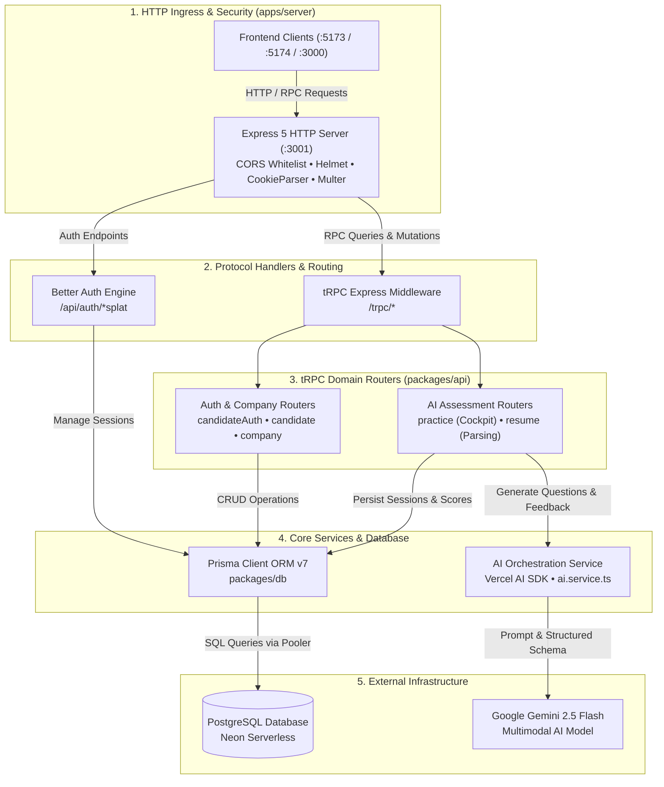

# Backend Architecture

This document covers the unified backend engine of **Interview.AI** (`apps/server`) and its underlying service layers.

---

## 🛠️ Architecture Overview

The backend is organized as a high-performance Express 5 server powered by the Bun runtime. It serves both the **Candidate** and **Recruiter** frontends through a unified tRPC v11 API layer and Better Auth authentication system.



---

## 💻 Tech Stack

| Component | Technology | Version | Purpose |
| :--- | :--- | :--- | :--- |
| **Runtime** | Bun | Latest | Fast execution, built-in bundling, TS transpilation |
| **HTTP Server** | Express | 5.2.1 | Lightweight, flexible HTTP request handling |
| **Security & Middleware** | Helmet, CORS, Morgan | Latest | HTTP security headers, CORS origin controls, logging |
| **File/Audio Ingress** | Multer | 2.1.1 | Disk storage for resumes (<5MB) and audio recordings (<15MB) |
| **API Layer** | tRPC Server | 11.18.0 | End-to-end typesafe RPC router without code generation |
| **Authentication** | Better Auth | 1.6.23 | Modern session/token authentication with Prisma adapter |
| **ORM** | Prisma | 7.8.0 | Schema modeling, migrations, and typesafe SQL query builder |
| **Database** | PostgreSQL on Neon | 15+ | Relational data persistence with serverless connection pooling |
| **AI LLM Client** | Vercel AI SDK + Google Provider | `ai@^6.0.202`, `@ai-sdk/google@^3.0.81` | Schema-driven structured LLM invocation with Gemini 2.5 Flash |
| **Schema Validation** | Zod | 4.4.3 | Runtime validation for tRPC inputs and AI outputs |

---

## 🔐 Authentication & Session Flow (Better Auth)

Better Auth handles multi-role authentication for candidates and recruiters.

### Server Configuration (`packages/better-auth/server/index.ts`)
```typescript
export const auth = betterAuth({
  secret: process.env.BETTER_AUTH_SECRET,
  database: prismaAdapter(prisma, { provider: "postgresql" }),
  baseURL: authUrl,
  trustedOrigins: [
    clientUrl,
    "https://candidate.yourdomain.com",
    "http://localhost:5173",
    "http://localhost:5174",
  ].filter(Boolean),
  advanced: {
    disableCSRFCheck: true, // Enables cross-origin requests between Next.js frontends and Express
    defaultCookieAttributes: {
      sameSite: isProd ? "none" : "lax",
      secure: isProd,
    },
  },
  account: { storeStateStrategy: "database" },
  emailAndPassword: { enabled: true },
  socialProviders: {
    github: { clientId: process.env.GITHUB_CLIENT_ID, clientSecret: process.env.GITHUB_CLIENT_SECRET },
    google: { clientId: process.env.GOOGLE_CLIENT_ID, clientSecret: process.env.GOOGLE_CLIENT_SECRET },
  },
});
```

### Session Resolution in tRPC
In `packages/api/src/trpc.ts`, `createTRPCContext` extracts incoming request headers and calls `auth.api.getSession({ headers: fromNodeHeaders(req.headers) })`.
- `protectedProcedure`: Validates session existence, attaching `ctx.userId` and `ctx.session`.
- `protectedCandidateProcedure`: Queries `Candidate` matching `userId` and injects `ctx.candidateId`.
- `protectedRecruiterProcedure`: Queries `Recruiter` matching `userId` and injects `ctx.recruiterId` and `ctx.companyId`.
- `protectedCompanyOwnerProcedure`: Verifies user is the `ownerId` of the `Company` and injects `ctx.companyId`.

---

## 📁 Multer Middleware (`apps/server/src/middleware/multer.middleware.ts`)

Configured with two disk storage instances writing to `./public`:
1. **`upload`**: Standard document uploader capped at **5MB** for PDF resumes.
2. **`uploadAudio`**: Dedicated audio recording uploader capped at **15MB** supporting `.webm`, `.ogg`, and `.mp3` mimetypes. Supports long vocal answers.

---

## 🎟️ Invitation Token Generation Algorithm

Company and recruiter invitations use a cryptographically secure, human-readable random string generator (`packages/api/src/utils/invite-token.ts`):
```typescript
export function generateInviteCode(length = 12): string {
  // Uses Crockford Base32 alphabet (omits 0, 1, I, L, O to eliminate visual ambiguity)
  const chars = "23456789ABCDEFGHJKMNPQRSTUVWXYZ";
  const byteArray = new Uint8Array(length);
  getRandomValues(byteArray);
  let result = "";
  for (let i = 0; i < length; i++) {
    result += chars[byteArray[i] % chars.length];
  }
  return result;
}
```
- **Recruiter Invites**: Length 12, expires in 7 days (`now + 7d`).
- **Candidate Invites**: Length 16, expires in 7 days (`now + 7d`).

---

## 🤖 AI Orchestration Engine (`packages/api/src/services/ai.service.ts`)

Powered by **Google Gemini 2.5 Flash** using the Vercel AI SDK:

### 1. Resume Multimodal Analysis (`analyzeResume`)
- Accepts PDF file buffer directly via multimodal message payload.
- Enforces output matching `ResumeAnalysisSchema` via `Output.object`.
- Extracts: `name`, `email`, `skills`, `projects`, `experienceyears`, `education`, `suggestedRoles`, and `summary`.

### 2. Practice Question Synthesis (`generatePracticeInterviewQuestions`)
- Merges candidate resume analysis with target job title and experience level.
- Synthesizes exactly 5 progressive questions across 5 difficulty/focus tracks.
- Enforces question length under 25 words to optimize for natural verbal flow in the voice cockpit.

### 3. Interview Evaluation & Diagnostic Report (`generatePracticeInterviewReport`)
- Consumes the full interview transcript (all 5 questions with candidate verbal answers).
- Evaluates candidate on communication, correctness, and confidence.
- Returns structured JSON: `overallScore`, `strengths`, `weaknesses`, `summary`, and `recommendation`.

### 4. Company Interview Question Generation (`generateCompanyInterviewQuestions`)
- Takes recruiter job specifications (job title, job description, experience level, custom prompt directives).
- Generates tailored question sets adhering to the job's `InterviewConfig`.
