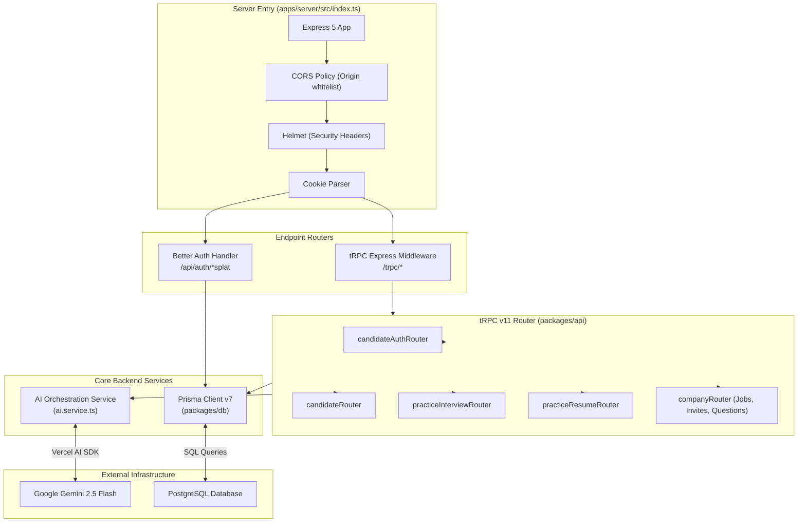
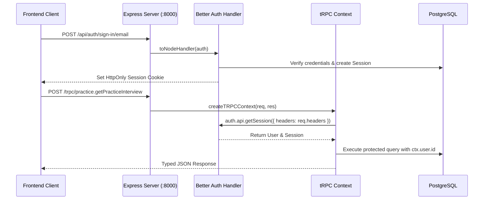
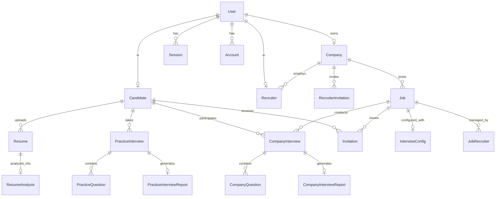

# Backend Architecture

This document covers the unified backend engine of **Interview.AI** (`apps/server`) and its underlying service layers.

---

## 🛠️ Architecture Overview

The backend is organized as a single high-performance Express 5 server powered by the Bun runtime. It serves both the **Candidate** and **Recruiter** frontends through a unified tRPC v11 API layer and Better Auth authentication system.

---

## 💻 Tech Stack

| Component | Technology | Version | Purpose |
| :--- | :--- | :--- | :--- |
| **Runtime** | Bun | Latest | Fast execution, built-in bundling, TS transpilation |
| **HTTP Server** | Express | 5.2.1 | Lightweight, flexible HTTP request handling |
| **Security & Middleware** | Helmet, CORS, Morgan | Latest | HTTP security headers, CORS origin controls, logging |
| **API Layer** | tRPC Server | 11.18.0 | End-to-end typesafe RPC router without code generation |
| **Authentication** | Better Auth | 1.6.23 | Modern session/token authentication with Prisma adapter |
| **ORM** | Prisma | 7.8.0 | Schema modeling, migrations, and typesafe SQL query builder |
| **Database** | PostgreSQL | 15+ | Relational data persistence |
| **AI LLM Client** | Vercel AI SDK + Google Provider | `ai@^6.0.202`, `@ai-sdk/google@^3.0.81` | Schema-driven structured LLM invocation with Gemini 2.5 Flash |
| **Schema Validation** | Zod | 4.4.3 | Runtime validation for tRPC inputs and AI outputs |

---

## 🔐 Authentication & Session Flow (Better Auth)

Better Auth handles multi-role authentication for candidates and recruiters.

### Integration
- **Server Hook**: Mounted in Express at `/api/auth/*splat` using `toNodeHandler(auth)`.
- **Database Adapter**: Backed by `@better-auth/prisma-adapter` managing `User`, `Account`, `Session`, and `Verification` tables.
- **Session Resolution**: In `createTRPCContext` (`packages/api/src/trpc.ts`), cookies and headers are inspected to resolve the active user and session before executing procedures.

---

## 🗄️ Database Schema & Data Modeling (`packages/db`)

The database consists of 18 relational models partitioned into four logical domains:

### Core Schema Domains:
1. **Auth & Identity**: `User`, `Account`, `Session`, `Verification`.
2. **Candidate Domain**:
   - `Candidate`: Manages practice credits (default 100).
   - `Resume`: Stores PDF metadata and download links.
   - `ResumeAnalysis`: Structured extraction (skills array, projects JSON, education JSON, suggested roles, experience years).
   - `PracticeInterview`: Tracks status (`PENDING`, `IN_PROGRESS`, `COMPLETED`), role, and mode (`TECHNICAL` vs. `HR`).
   - `PracticeQuestion`: Questions with time limits, scores, user transcripts, and AI feedback.
   - `PracticeInterviewReport`: Aggregate score, strengths, weaknesses, executive summary, and recommendations.
3. **Company & Recruiter Domain**:
   - `Company`: Credits (default 100), brand details, and owner reference.
   - `Recruiter`: Staff member designation linked to Company.
   - `RecruiterInvitation`: Tokens for adding colleagues to the hiring team.
   - `Job`: Position requisites, experience bounds, and status (`DRAFT`, `OPEN`, `PAUSED`, `CLOSED`).
   - `JobRecruiter`: Many-to-many relationship assigning recruiters to specific job openings.
4. **Company Interview Assessment Domain**:
   - `InterviewConfig`: Per-job configuration (question count, duration minutes, prompt overrides).
   - `Invitation`: Secure tokenized candidate interview invite with expiration date.
   - `CompanyInterview`: Scheduled assessment lifecycle.
   - `CompanyQuestion`: Real-time candidate answers, category tags, and question scores.
   - `CompanyInterviewReport`: Candidate hiring recommendation, score breakdown, and evaluation summary.

---

## 🤖 AI Orchestration Engine (`packages/api/src/services/ai.service.ts`)

Powered by **Google Gemini 2.5 Flash** using the Vercel AI SDK:

### 1. Resume Multimodal Analysis (`analyzeResume`)
- Accepts PDF file buffer directly via multimodal message payload.
- Enforces output matching `ResumeAnalysisSchema` via `Output.object`.
- Extracts: `name`, `email`, `skills`, `projects`, `experienceyears`, `education`, `suggestedRoles`, and `summary`.

### 2. Practice Question Synthesis (`generatePracticeInterviewQuestions`)
- Merges candidate resume analysis with target job title and experience level.
- Synthesizes exactly 5 progressive questions across 5 difficulty/focus tracks.
- Enforces question length under 25 words to optimize for natural verbal flow in the voice cockpit.

### 3. Interview Evaluation & Diagnostic Report (`generatePracticeInterviewReport`)
- Consumes the full interview transcript (all 5 questions with candidate verbal answers).
- Evaluates candidate on communication, correctness, and confidence.
- Returns structured JSON: `overallScore`, `strengths`, `weaknesses`, `summary`, and `recommendation`.

### 4. Company Interview Question Generation (`generateCompanyInterviewQuestions`)
- Takes recruiter job specifications (job title, job description, experience level, custom prompt directives).
- Generates tailored question sets adhering to the job's `InterviewConfig`.
