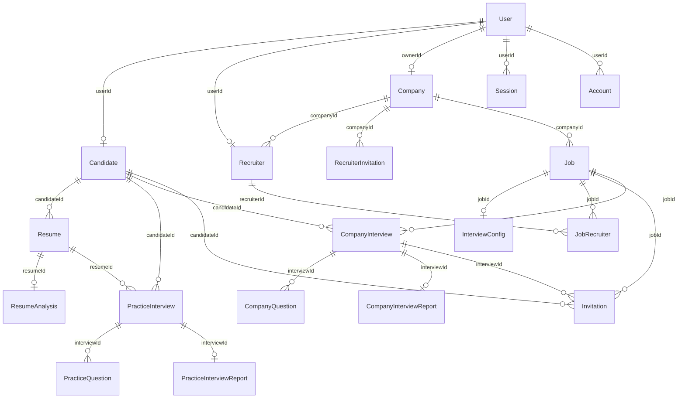

# Database Schema Reference

This document provides a comprehensive specification for the PostgreSQL database managed by **Prisma ORM v7** (`packages/db/prisma/schema.prisma`).

---

## 📊 Entity Relationship Diagram (ERD)

---

## 🗂️ Enum Definitions

### `Difficulty`
- `EASY`: Calibrated to 60s answer time limit. Focuses on foundational syntax, introduction, or concepts.
- `MEDIUM`: Calibrated to 90s answer time limit. Focuses on practical implementation, project deep dive, and behavioral scenarios.
- `HARD`: Calibrated to 120s answer time limit. Focuses on system scalability, complex architecture, and trade-offs.

### `InterviewMode`
- `TECHNICAL`: Focuses on architecture, code patterns, algorithms, system design, and engineering tradeoffs.
- `HR`: Focuses on communication, behavioral STAR method, teamwork, conflict resolution, and cultural fit.

### `InterviewStatus`
- `PENDING`: Initial state upon creation before candidate clicks start.
- `IN_PROGRESS`: Candidate is actively participating in the live interview cockpit.
- `COMPLETED`: All answers submitted and AI diagnostic report generated.
- `EXPIRED`: Assessment time window lapsed without completion.
- `CANCELLED`: Withdrawn by recruiter or candidate.

### `JobStatus`
- `DRAFT`: Job opening being configured, not yet visible for invitations.
- `OPEN`: Actively accepting candidate invitations.
- `PAUSED`: Temporarily paused from sending new assessments.
- `CLOSED`: Hiring concluded.

### `InvitationStatus`
- `PENDING`: Invite token created, waiting for candidate/recruiter acceptance.
- `ACCEPTED`: Successfully registered/linked to interview or company.
- `REJECTED`: Explicitly declined.
- `EXPIRED`: Token exceeded 7-day expiration window.

---

## 📑 Model Specifications

### 1. Authentication & User Tables (`better-auth`)

#### `User` (mapped to `user`)
| Column | Type | Attributes | Description |
| :--- | :--- | :--- | :--- |
| `id` | `String` | `@id @default(cuid())` | Unique user identifier |
| `name` | `String` | | Full name |
| `email` | `String` | `@unique` | Primary email address |
| `photoUrl` | `String?` | | Profile avatar URL |
| `emailVerified` | `Boolean` | `@default(false)` | Better Auth verification flag |
| `image` | `String?` | | Better Auth OAuth avatar |
| `createdAt` | `DateTime`| `@default(now())` | Creation timestamp |
| `updatedAt` | `DateTime`| `@updatedAt` | Last modification timestamp |

#### `Account` (mapped to `account`)
- Stores OAuth and credential authentication details.
- Cascade deletes when `User` is deleted (`onDelete: Cascade`).
- Indexes: `[userId]`.

#### `Session` (mapped to `session`)
- Active login sessions with tokens, IP address, user-agent, and expiration.
- Indexes: `[userId]`, unique on `[token]`.

#### `Verification` (mapped to `verification`)
- Time-decaying email/token verification values for magic links and password resets.
- Indexes: `[identifier]`.

---

### 2. Candidate Domain Tables

#### `Candidate`
- **Fields**: `id` (cuid), `credits` (`Int @default(100)`), `userId` (`String @unique`).
- **Cascade**: Deletes when `User` is removed (`onDelete: Cascade`).
- **Relations**: Has many `CompanyInterview`, `Invitation`, `Resume`, and `PracticeInterview`.

#### `Resume`
- **Fields**: `id` (cuid), `fileName` (`String`), `fileUrl` (`String`), `candidateId` (`String`).
- **Cascade**: Deletes when `Candidate` is removed (`onDelete: Cascade`).
- **Indexes**: `[candidateId]`, `[createdAt]`.

#### `ResumeAnalysis`
- **Fields**:
  - `name`: Candidate parsed name.
  - `email`: Parsed email.
  - `skills`: `String[]` array of technical/domain skills.
  - `projects`: `Json[]` project objects with name and descriptions.
  - `experienceyears`: Extracted total years of experience.
  - `education`: `Json[]` education objects with degree, institution, and year.
  - `suggestedRoles`: `String[]` candidate matched titles.
  - `summary`: Markdown text executive profile summary.
  - `resumeId`: `String @unique` (1:1 with `Resume`).

#### `PracticeInterview`
- **Fields**: `id` (cuid), `role` (`String`), `interviewMode` (`InterviewMode`), `experienceYears` (`Int`), `status` (`InterviewStatus @default(PENDING)`), `startedAt` (`DateTime?`), `completedAt` (`DateTime?`).
- **Foreign Keys**: `candidateId`, `resumeId?`.
- **Relations**: 1:1 with `PracticeInterviewReport`, 1:N with `PracticeQuestion`.
- **Indexes**: `[candidateId]`, `[status]`.

#### `PracticeQuestion`
- **Fields**:
  - `questionText`: Spoken question prompt (under 25 words).
  - `difficulty`: `Difficulty` (EASY / MEDIUM / HARD).
  - `timeLimitSeconds`: Dynamic timer (60s / 90s / 120s).
  - `userAnswer`: `String? @db.Text` (spoken transcript).
  - `aiFeedback`: `String? @db.Text` (per-question AI critique).
  - `questionScore`, `confidenceScore`, `communicationScore`, `correctnessScore`: Sub-scores (0–100).
  - `durationSeconds`: Recorded answer duration.
  - `displayOrder`: Question sequential index (1 to 5).
  - `isAnswered`: Boolean submission flag.
- **Constraints**: `@@unique([interviewId, displayOrder])`.
- **Indexes**: `[interviewId]`.

#### `PracticeInterviewReport`
- **Fields**: `id` (cuid), `overallScore` (`Int`), `strengths` (`String[]`), `weaknesses` (`String[]`), `summary` (`String @db.Text`), `recommendation` (`String? @db.Text`).
- **Constraint**: `interviewId @unique` (1:1 with `PracticeInterview`).

---

### 3. Recruiter & Enterprise Domain Tables

#### `Company`
- **Fields**: `id` (cuid), `credits` (`Int @default(100)`), `name` (`String @unique`), `website` (`String?`), `logoUrl` (`String?`), `ownerId` (`String @unique`).
- **Cascade**: Deletes when owner `User` is removed (`onDelete: Cascade`).
- **Relations**: 1:N with `Recruiter`, `RecruiterInvitation`, and `Job`.

#### `Recruiter`
- **Fields**: `id` (cuid), `designation` (`String?`), `userId` (`String @unique`), `companyId` (`String`).
- **Relations**: M:N with `Job` via `JobRecruiter`.
- **Indexes**: `[companyId]`.

#### `RecruiterInvitation`
- **Fields**: `token` (`String @id`), `email` (`String`), `status` (`InvitationStatus @default(PENDING)`), `expiresAt` (`DateTime`), `companyId` (`String`).
- **Indexes**: `[email]`, `[companyId]`.

#### `Job`
- **Fields**: `id` (cuid), `title` (`String`), `description` (`String @db.Text`), `status` (`JobStatus @default(DRAFT)`), `minExperienceYears` (`Int`), `maxExperienceYears` (`Int?`), `companyId` (`String`).
- **Indexes**: `[companyId]`, `[status]`.
- **Relations**: 1:1 with `InterviewConfig`, 1:N with `JobRecruiter`, `Invitation`, and `CompanyInterview`.

#### `JobRecruiter`
- **Compound Primary Key**: `@@id([jobId, recruiterId])`.
- **Fields**: `jobId`, `recruiterId`, `assignedAt`.
- **Indexes**: `[recruiterId]`, `[jobId]`.

#### `InterviewConfig`
- **Fields**: `id` (cuid), `questionCount` (`Int`), `interviewMode` (`InterviewMode`), `durationMinutes` (`Int`), `prompt` (`String? @db.Text`), `jobId` (`String @unique`).

#### `Invitation` (Candidate Job Assessment Invite)
- **Fields**: `id` (cuid), `token` (`String @unique`), `expiresAt` (`DateTime`), `status` (`InvitationStatus @default(PENDING)`), `acceptedAt` (`DateTime?`), `candidateEmail` (`String`), `candidateName` (`String?`), `candidateId` (`String?`), `jobId` (`String`), `interviewId` (`String?`).
- **Indexes**: `[candidateEmail]`, `[candidateId]`, `[jobId]`, `[status]`.

#### `CompanyInterview`
- **Fields**: `id` (cuid), `status` (`InterviewStatus @default(PENDING)`), `startedAt` (`DateTime?`), `completedAt` (`DateTime?`), `candidateId` (`String`), `jobId` (`String?`).
- **Indexes**: `[candidateId]`, `[jobId]`, `[status]`.
- **Relations**: 1:N with `CompanyQuestion`, 1:1 with `CompanyInterviewReport`.

#### `CompanyQuestion`
- **Fields**: Same structure as `PracticeQuestion`, scoped to `CompanyInterview`.
- **Constraints**: `@@unique([interviewId, displayOrder])`.
- **Indexes**: `[interviewId]`.

#### `CompanyInterviewReport`
- **Fields**: `overallScore` (`Int`), `strengths` (`String[]`), `weaknesses` (`String[]`), `summary` (`String @db.Text`), `recommendation` (`String? @db.Text`), `interviewId` (`String @unique`).
