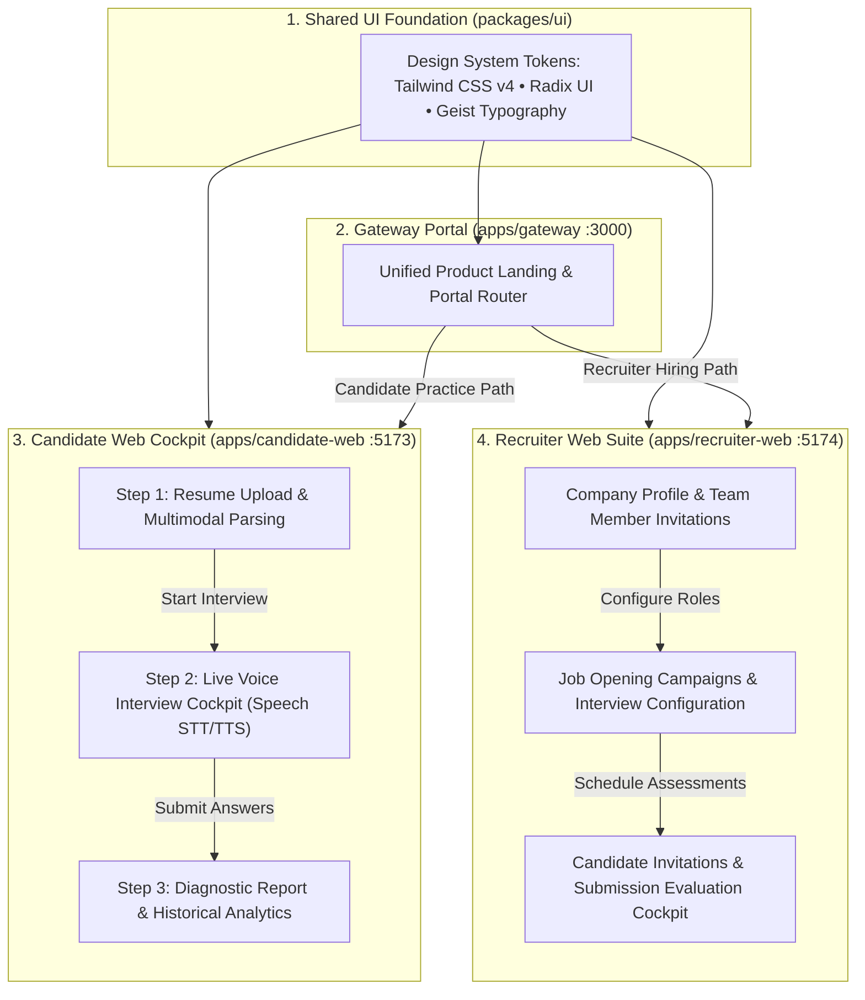
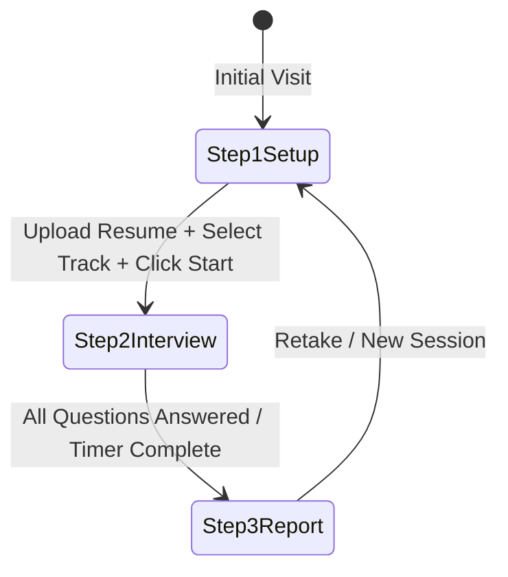

# Frontend Architecture

This document covers the frontend layer of **Interview.AI**, comprising three specialized Next.js applications and the shared UI component package.

---

## 🏗️ Architecture Overview

The frontend layer is structured as three specialized applications:

```
apps/
├── gateway/          # Route portal & product landing page (Port 3000)
├── candidate-web/    # Candidate practice & assessment cockpit (Port 5173)
└── recruiter-web/    # Recruiter campaigns & evaluation dashboard (Port 5174)
```

All three applications share common components and design primitives from `packages/ui`.



---

## 💻 Tech Stack

| Domain | Technology | Version | Purpose |
| :--- | :--- | :--- | :--- |
| **Framework** | Next.js (App Router) | 15.1.7 | Server-side rendering, streaming SSR, metadata API, file-based routing |
| **Core Library** | React & React-DOM | 19.0.0 | UI rendering engine |
| **Styling** | Tailwind CSS | 4.0.0 | Utility-first CSS using modern CSS `@theme` declarations |
| **Component Primitives** | Radix UI | 1.5.0 | Unstyled, accessible UI foundation (Dialogs, Dropdowns, Tooltips) |
| **Icons** | Lucide React & React Icons | 1.17.0 | Crisp, uniform icon set |
| **Typography** | Geist & Geist Mono | 5.2.9 | Custom geometric sans display face and technical monospaced font |
| **Animations** | Motion (Framer Motion) | 12.40.0 | Smooth micro-animations, transitions, and gesture controls |
| **Data Fetching & Cache**| TanStack React Query | 5.101.2 | Declarative server-state caching, background revalidation, mutations |
| **API Client** | tRPC React Query Client | 11.18.0 | Fully typed client for invoking backend tRPC procedures with cookie credentials |
| **Local State** | Jotai | 2.20.0 | Atomic, granular client-side state (`userAtom`) |
| **Form Management** | React Hook Form + Zod | 7.79.0 | High-performance, schema-validated forms |
| **File Storage** | Cloudinary Direct Upload | REST | Unsigned PDF resume upload via `uploadToCloudinary` |
| **Audio/Voice** | Browser Web Speech API | Native | SpeechRecognition for STT and SpeechSynthesis for TTS |
| **Countdown Timer** | React Countdown Circle Timer | 3.2.1 | Visual SVG radial countdown timer for calibrated question limits |

---

## 🎨 Design System & Aesthetics (Inspired by `DESIGN.md`)

The frontend adheres to the sleek, developer-first **Vercel design language**:

### 1. Color Palette
- **Canvas (`#ffffff`)**: Card surfaces, modal dialogs, and elevated panels.
- **Canvas Soft (`#fafafa`)**: Primary background for pages and neutral sections.
- **Ink (`#171717`)**: High-contrast text, primary conversion CTAs, and dark-band polarity flips.
- **Hairline (`#ebebeb`)**: 1px subtle card outlines, dividers, and input borders.
- **Atmospheric Mesh Gradient**: Multi-color gradient (Cyan `#50e3c2` → Violet `#7928ca` → Magenta `#ff0080` → Amber `#f9cb28`) utilized at hero scale for atmospheric depth.

### 2. Typography
- **Geist Sans**: Headings (`display-xl` to `display-sm`) set at weight 600 with negative tracking (`-2.4px` to `-0.6px`), sentence-cased.
- **Geist Mono**: Technical labels, time counters, status badges, code editor frames, and section eyebrows.

### 3. Elevation & Depth
- Avoids heavy drop-shadows. Instead, uses **stacked soft shadows** combined with a 1px inset hairline:
  ```css
  box-shadow: 0px 1px 1px #00000005, 0px 2px 2px #0000000a, 0 0 0 1px #00000014 inset;
  ```

---

## 🎙️ Live Interview Cockpit Architecture (`candidate-web`)

The mock interview cockpit (`apps/candidate-web/src/views/Interview.tsx`) implements a three-step state machine:



### 1. Step 1: Setup (`step-1-setup.tsx`)
- Drag-and-drop resume upload (PDF < 5MB).
- **Direct Cloudinary Upload**:
  ```typescript
  // apps/candidate-web/src/lib/cloudinary.ts
  const formData = new FormData();
  formData.append("file", file);
  formData.append("upload_preset", "interview-ai");
  const res = await fetch(`https://api.cloudinary.com/v1_1/${cloudName}/auto/upload`, {
    method: "POST",
    body: formData,
  });
  ```
- **Automated Resume Analysis**: Calls `trpc.resume.createResume` followed by `trpc.resume.analyzeResume`. The AI response populates candidate profile data (Name, Experience, Core Skills, Projects, Education, Summary).
- Candidate selects target Job Role, Experience Years, and Interview Track (`TECHNICAL` vs `HR`).
- On submission, calls `trpc.practice.createPracticeInterview` and `trpc.practice.createPracticeInterviewQuestions`.

### 2. Step 2: Live Cockpit (`step-2-interview.tsx`)
- **Speech Synthesis (TTS)**:
  - Questions are verbalized aloud automatically upon question mount (`apps/candidate-web/src/lib/speech-synthesis.ts`):
  ```typescript
  const utterThis = new SpeechSynthesisUtterance(text);
  utterThis.rate = 0.92;
  utterThis.pitch = 0.98;
  utterThis.volume = 1.0;
  utterThis.lang = "en-US";
  utterThis.voice = synth.getVoices()[182] || synth.getVoices()[0];
  synth.speak(utterThis);
  ```
- **Speech Recognition (STT)**:
  - Uses `window.webkitSpeechRecognition` or `window.SpeechRecognition`.
  - Configured with `continuous = true`, `interimResults = true`, `lang = "en-US"`.
  - Filters out harmless non-speech events (`no-speech`, `aborted`).
  - Streams live transcript into local state and stores full answer in a reference.
- **Dynamic Difficulty Timers**:
  - `EASY`: 60 seconds
  - `MEDIUM`: 90 seconds
  - `HARD`: 120 seconds
- **Video Avatar Synchronization**:
  - A looped video (`female-ai.mp4`) plays in the background, simulating an authentic interviewer.
- **Answer Submission**:
  - Automatically submits when timer hits 0 or candidate clicks "Submit Answer", calling `trpc.practice.submitAnswer`.

### 3. Step 3: Diagnostic Evaluation Dashboard (`step-3-report.tsx`)
- Displays overall score (0–100) from `PracticeInterviewReport.overallScore`.
- Averages per-question sub-metrics: Correctness Score, Communication Score, Confidence Score.
- Shows AI-curated Strengths list, Weaknesses list, and Actionable Recommendations.
- Interactive question-by-question accordion showing the exact question prompt, candidate spoken transcript, and AI feedback.
- Candidates can start a new interview or return to the landing page.

### 4. Interview History (`apps/candidate-web/src/views/InterviewHistory.tsx`)
- Fetches all historical sessions using `trpc.practice.getPracticeInterviewHistory.useQuery()`.
- Renders past interviews with difficulty badges, timestamps, completion statuses, and expandable diagnostic feedback.

### 5. Credits System & Navbar Counter
- **Starter Credits**: Every new candidate receives 100 starter credits upon account initialization via `candidateAuth.becomeCandidate`.
- **Live Credit Badge**: The desktop and mobile navbar renders a dynamic `CandidateCredits` pill showing remaining balance (`Credits: {candidate?.credits ?? 0}`), with a contextual modal/popover prompting users to replenish credits.

---

## 🏢 Recruiter Web Status & Architecture (`recruiter-web`)

- **Current Status**: Backend procedures (`packages/api/src/routers/company/*`) and database models (`Company`, `Job`, `InterviewConfig`, `Invitation`, `CompanyInterview`, `CompanyInterviewReport`) are **100% complete and operational**. The `recruiter-web` application currently houses the base App Router shell, theme providers, and authentication pages, with dedicated management dashboards currently under development.
- **Planned Views**:
  - `/dashboard`: High-level recruitment metrics and active job openings.
  - `/jobs/new`: Creation wizard with AI question generation preview.
  - `/interviews/[id]`: Review cockpit inspecting candidate transcripts, scoring charts, and hiring recommendations.

---

## 🌐 Gateway Portal (`gateway`)

Acts as the root traffic router (Port `3000`):
- Clean hero showcasing the dual value propositions:
  - **Candidates**: "Practice with an AI Interviewer and get hired." -> Directs to `http://localhost:5173`.
  - **Recruiters**: "Automate technical screening interviews at scale." -> Directs to `http://localhost:5174`.

---

## 🔀 Production Rewrites & Reverse Proxy (`vercel.json`)

To eliminate cross-origin cookie restrictions and streamline deployment on Vercel, both `apps/candidate-web` and `apps/gateway` include a `vercel.json` rewrite configuration:

```json
{
  "rewrites": [
    {
      "source": "/api/auth/:path*",
      "destination": "https://api.yourdomain.com/api/auth/:path*"
    },
    {
      "source": "/trpc/:path*",
      "destination": "https://api.yourdomain.com/trpc/:path*"
    },
    {
      "source": "/(.*)",
      "destination": "/index.html"
    }
  ]
}
```

This allows the client web apps to invoke `/api/auth/*` and `/trpc/*` as same-origin paths in production while Vercel reverse-proxies them to the backend API server.

