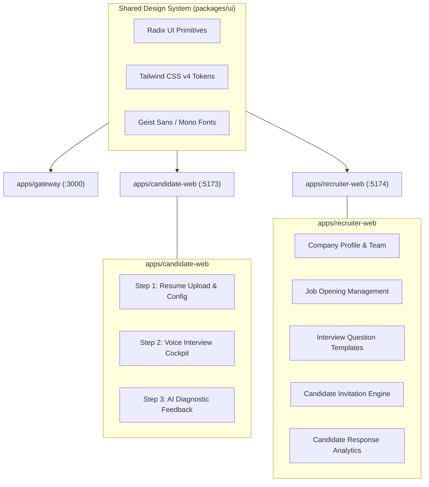
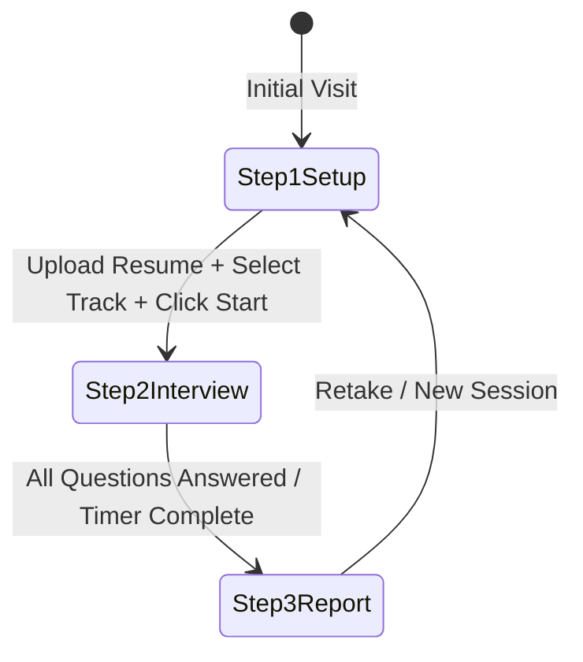

# Frontend Architecture

This document covers the frontend layer of **Interview.AI**, comprising three distinct Next.js applications and a shared UI component package.

---

## 🏗️ Architecture Overview

The frontend layer is structured as three specialized applications:

```
apps/
├── gateway/          # Route portal & landing page (Port 3000)
├── candidate-web/    # Candidate practice & assessment cockpit (Port 5173)
└── recruiter-web/    # Recruiter campaigns & evaluation dashboard (Port 5174)
```

All three applications share common components and design primitives from `packages/ui`.



---

## 💻 Tech Stack

| Domain | Technology | Version | Purpose |
| :--- | :--- | :--- | :--- |
| **Framework** | Next.js (App Router) | 15.1.7 | Server-side rendering, streaming SSR, metadata API, file-based routing |
| **Core Library** | React & React-DOM | 19.0.0 | UI rendering engine |
| **Styling** | Tailwind CSS | 4.0.0 | Utility-first CSS using modern CSS `@theme` declarations |
| **Component Primitives** | Radix UI | 1.5.0 | Unstyled, accessible UI foundation (Dialogs, Dropdowns, Tooltips) |
| **Icons** | Lucide React & React Icons | 1.17.0 | Crisp, uniform icon set |
| **Typography** | Geist & Geist Mono | 5.2.9 | Custom geometric sans display face and technical monospaced font |
| **Animations** | Motion (Framer Motion) | 12.40.0 | Smooth micro-animations, transitions, and gesture controls |
| **Data Fetching & Cache**| TanStack React Query | 5.101.2 | Declarative server-state caching, background revalidation, mutations |
| **API Client** | tRPC React Query Client | 11.18.0 | Fully typed client for invoking backend tRPC procedures |
| **Local State** | Jotai | 2.20.0 | Atomic, granular client-side state |
| **Form Management** | React Hook Form + Zod | 7.79.0 | High-performance, schema-validated forms |
| **Audio/Voice** | Browser Web Speech API | Native | SpeechRecognition for STT and SpeechSynthesis for TTS |
| **Countdown Timer** | React Countdown Circle Timer | 3.2.1 | Visual SVG radial countdown timer for question time limits |

---

## 🎨 Design System & Aesthetics (Inspired by `DESIGN.md`)

The frontend adheres to the sleek, developer-first **Vercel design language**:

### 1. Color Palette
- **Canvas (`#ffffff`)**: Card surfaces, modal dialogs, and elevated panels.
- **Canvas Soft (`#fafafa`)**: Primary background for pages and neutral sections.
- **Ink (`#171717`)**: High-contrast text, primary conversion CTAs, and dark-band polarity flips.
- **Hairline (`#ebebeb`)**: 1px subtle card outlines, dividers, and input borders.
- **Atmospheric Mesh Gradient**: Multi-color gradient (Cyan `#50e3c2` → Violet `#7928ca` → Magenta `#ff0080` → Amber `#f9cb28`) utilized at hero scale for atmospheric depth.

### 2. Typography
- **Geist Sans**: Headings (`display-xl` to `display-sm`) set at weight 600 with negative tracking (`-2.4px` to `-0.6px`), sentence-cased.
- **Geist Mono**: Technical labels, time counters, status badges, code editor frames, and section eyebrows.

### 3. Elevation & Depth
- Avoids heavy drop-shadows. Instead, uses **stacked soft shadows** combined with a 1px inset hairline:
  ```css
  box-shadow: 0px 1px 1px #00000005, 0px 2px 2px #0000000a, 0 0 0 1px #00000014 inset;
  ```

---

## 🎙️ Live Interview Cockpit Architecture (`candidate-web`)

The mock interview cockpit (`apps/candidate-web/src/views/Interview.tsx`) implements a three-step state machine:



### 1. Step 1: Setup (`step-1-setup.tsx`)
- Drag-and-drop resume upload (PDF) with automatic AI background parsing.
- Configuration controls: Role Title, Experience (Years), Track (`TECHNICAL` vs. `HR`).
- On start, invokes `trpc.practice.createPracticeInterview`.

### 2. Step 2: Live Cockpit (`step-2-interview.tsx`)
- **Radial Countdown Timer**: Visual countdown matching `timeLimitSeconds`.
- **Speech Recognition**: Initializes `webkitSpeechRecognition` with continuous listening and interim results.
- **Speech Synthesis**: Converts the question text to natural speech on mount.
- **Avatar Looping Video**: Synced with audio playback to mimic an authentic interviewer.
- **Answer Submission**: Candidate clicks "Submit Answer" or the countdown triggers automatic submission, invoking `trpc.practice.submitAnswer`.

### 3. Step 3: Diagnostic Report (`step-3-report.tsx`)
- Displays overall score alongside categorized performance bars (Correctness, Communication, Confidence).
- Lists AI-generated strengths and weaknesses with targeted recommendations.
- Interactive question-by-question review showing the exact spoken transcript and question metrics.

---

## 🏢 Recruiter Web Architecture (`recruiter-web`)

Designed for corporate recruiting workflows:
- **Company Profile**: Setup company name, website, and recruiter member access.
- **Job Creation Suite**: Define job title, role descriptions, experience criteria, and status (`DRAFT`, `OPEN`, `PAUSED`, `CLOSED`).
- **Interview Configurator**: Tailor question count, interview mode (`TECHNICAL` vs `HR`), time limits, and custom prompt directives.
- **Candidate Invitation Manager**: Issue candidate invitations with time-decaying security tokens and track invitation statuses (`PENDING`, `ACCEPTED`, `REJECTED`, `EXPIRED`).
- **Submissions & Analytics Cockpit**: Inspect candidate transcripts, listen to responses, review AI composite scores, and export candidate evaluations.

---

## 🌐 Gateway Portal (`gateway`)

Acts as the root traffic router (Port `3000`):
- Clean hero showcasing the dual value propositions:
  - **Candidates**: "Practice with an AI Interviewer and get hired." -> Directs to `http://localhost:5173`.
  - **Recruiters**: "Automate technical screening interviews at scale." -> Directs to `http://localhost:5174`.
