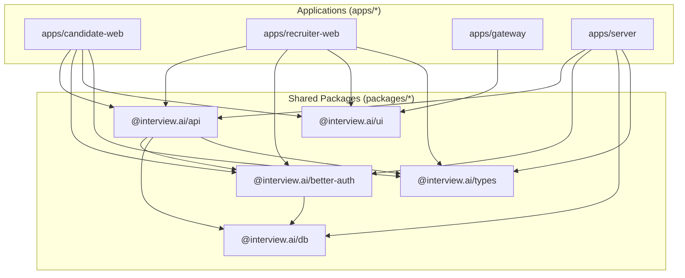

# Packages & Workspace Structure

This document details the monorepo structure, internal packages, and workspace orchestration in **Interview.AI**.

---

## 📦 Workspace Overview

The repository is organized as a **Bun Monorepo** using native workspace protocols (`workspace:*`).

```
interview.ai/
├── apps/
│   ├── candidate-web/    # Candidate practice web app (Next.js 15)
│   ├── recruiter-web/    # Recruiter assessment web app (Next.js 15)
│   ├── gateway/          # Portal landing application (Next.js 15)
│   └── server/           # Unified API server (Express 5 + Bun)
├── packages/
│   ├── api/              # tRPC router definitions, client, and AI services
│   ├── better-auth/      # Better Auth setup, plugins, and server exports
│   ├── db/               # Prisma ORM schema, client, and PostgreSQL migrations
│   ├── types/            # Shared TypeScript domain types and Zod schemas
│   └── ui/               # Shared Radix UI component library and styling
├── docs/                 # System architecture and context documentation
├── DESIGN.md             # Vercel-inspired design system specification
├── package.json          # Root workspace configuration
└── bun.lock              # Lockfile for reproducible builds
```

---

## 🔗 Dependency Graph



---

## 📦 Package Directory

### 1. `@interview.ai/types` (`packages/types`)
- **Role**: Pure type definitions and runtime Zod schemas. Zero heavy runtime dependencies.
- **Exports**:
  - `ai/`: Schemas for resume analysis, interview questions, and evaluation reports.
  - `auth/`: Authentication contracts and payload shapes.
  - `candidate/`: Candidate profile, credit, and history types.
  - `company/`: Company settings, invitation tokens, and member schemas.
  - `db/`: Extended database model types and composite relation types.
  - `interview/`: Session statuses, question formats, and scoring matrices.
  - `job/`: Job creation inputs and status enums.
  - `resume/`: File upload signatures and parsing status types.

### 2. `@interview.ai/db` (`packages/db`)
- **Role**: PostgreSQL database access layer via Prisma ORM v7.
- **Key Files**:
  - `prisma/schema.prisma`: Authoritative database schema with 18+ models and enums.
  - `index.ts`: Instantiates and exports the singleton `PrismaClient` using `@prisma/adapter-pg`.
  - `generated/prisma/`: Compiled TypeScript types and Prisma query engine client.
- **Exports**:
  - `.`: Main entrypoint exporting `prisma` client.
  - `./browser`: Browser-safe type imports.
  - `./enums`: Compiled Prisma enum constants (`InterviewStatus`, `InterviewMode`, `Difficulty`, `JobStatus`, `InvitationStatus`).

### 3. `@interview.ai/better-auth` (`packages/better-auth`)
- **Role**: Centralized authentication configuration.
- **Key Files**:
  - Configures Better Auth with `@better-auth/prisma-adapter`.
  - Links authentication credentials to the underlying `User` table.
  - Defines role mapping for Candidate vs. Recruiter users.

### 4. `@interview.ai/api` (`packages/api`)
- **Role**: Central API contracts, tRPC router hierarchy, and AI orchestration.
- **Key Modules**:
  - `src/_app.ts`: Root `appRouter` combining `candidateAuth`, `candidate`, `company`, `practice`, and `resume` sub-routers.
  - `src/trpc.ts`: Procedures initialization (`publicProcedure`, `protectedProcedure`), context creation (`createTRPCContext`).
  - `src/services/ai.service.ts`: Google Gemini 2.5 Flash operations (`analyzeResume`, `generatePracticeInterviewQuestions`, `generatePracticeInterviewReport`, `generateCompanyInterviewQuestions`).
  - `src/client.ts`: Typed React Query / tRPC client exports consumed by frontend applications.

### 5. `@interview.ai/ui` (`packages/ui`)
- **Role**: Shared UI component library adhering to `DESIGN.md`.
- **Export Mapping**:
  ```json
  "exports": {
    "./*": "./src/components/ui/*.tsx",
    "./components/*": "./src/components/*.tsx",
    "./lib/*": "./src/lib/*.ts",
    "./global.css": "./src/styles/global.css"
  }
  ```
  Enables clean direct imports across apps: `import { Button } from "@interview.ai/ui/button"`, `import { Card } from "@interview.ai/ui/card"`, etc.
- **Component Primitives**:
  - `avatar.tsx`, `badge.tsx`, `button.tsx`, `card.tsx`, `dialog.tsx`, `dropdown-menu.tsx`, `field.tsx`, `input.tsx`, `label.tsx`, `select.tsx`, `separator.tsx`.
  - Built with Radix UI, Tailwind CSS v4, Lucide icons, and `class-variance-authority` (cva).


---

## 🚀 Workspace Commands & Scripts

Managed from the root `package.json`:

| Command | Action |
| :--- | :--- |
| `bun run dev` | Runs all workspaces in parallel development mode |
| `bun run dev:server` | Starts the Express backend server (`apps/server`) with hot watch reload |
| `bun run dev:client` | Starts Candidate Web (`apps/candidate-web`) on port `5173` |
| `bun run build` | Generates Prisma client, compiles server, and builds Next.js applications |
| `bun run start` | Runs all production artifacts across workspaces |
