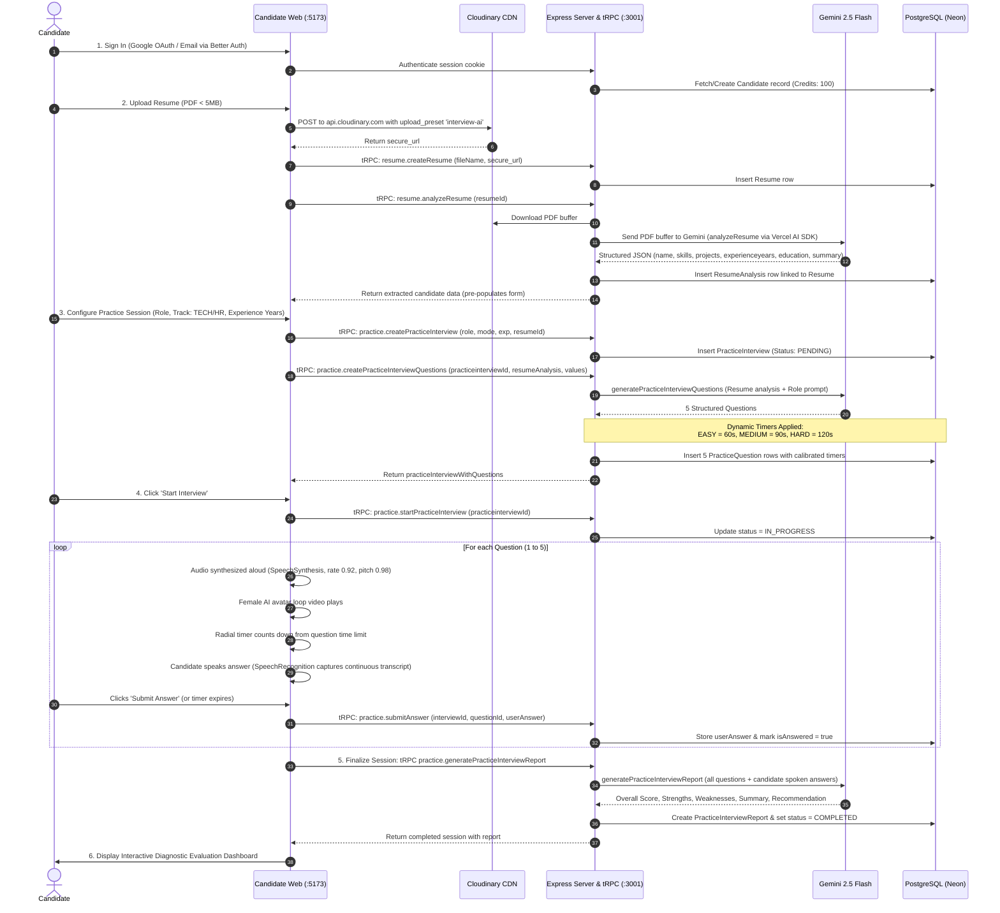
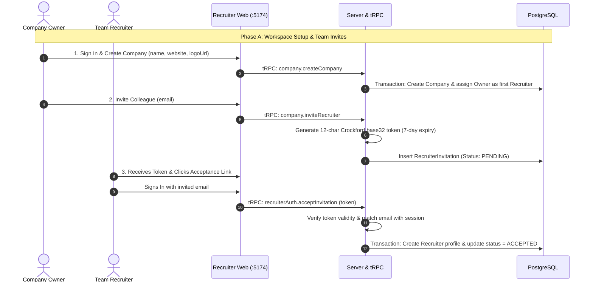
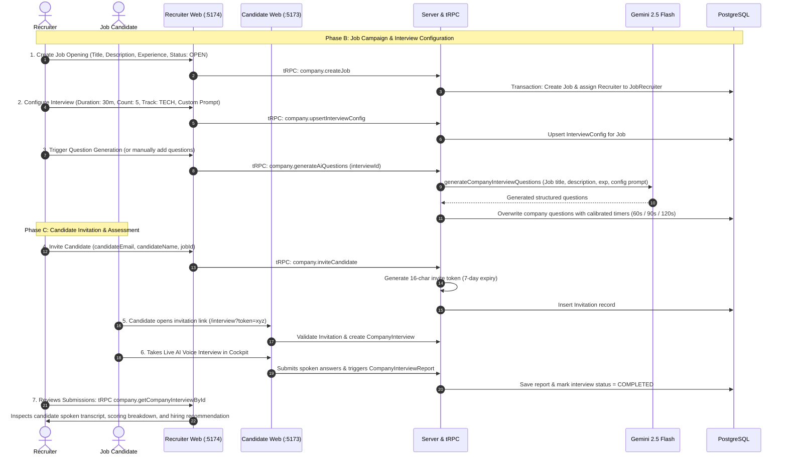
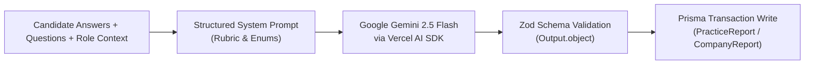

# High-Level Workflows & User Journeys

This document illustrates the operational journeys of **Candidates**, **Recruiters**, and the underlying **AI Evaluation Loop**, capturing all technical steps, storage pipelines, and timer behaviors.

---

## 1. Candidate Practice Workflow

Candidates use `apps/candidate-web` to prepare for high-stakes technical and behavioral interviews.

---

## 2. Recruiter Team & Campaign Workflow

Recruiters use `apps/recruiter-web` to manage corporate profiles, coordinate team hiring, post job openings, and issue automated candidate assessments.

---

## 3. AI Evaluation & Scoring Pipeline

The server's AI service (`packages/api/src/services/ai.service.ts`) executes a deterministic, schema-enforced pipeline:

### Scoring Dimensions:
- **Correctness Score (0–100)**: Accuracy of technical claims, algorithmic soundness, and domain competence.
- **Communication Score (0–100)**: Articulation, structure (e.g., STAR method), conciseness, and verbal clarity.
- **Confidence Score (0–100)**: Decisiveness, tone consistency, and response readiness under time constraints.
- **Overall Score**: Weighted composite index reflecting role suitability.
