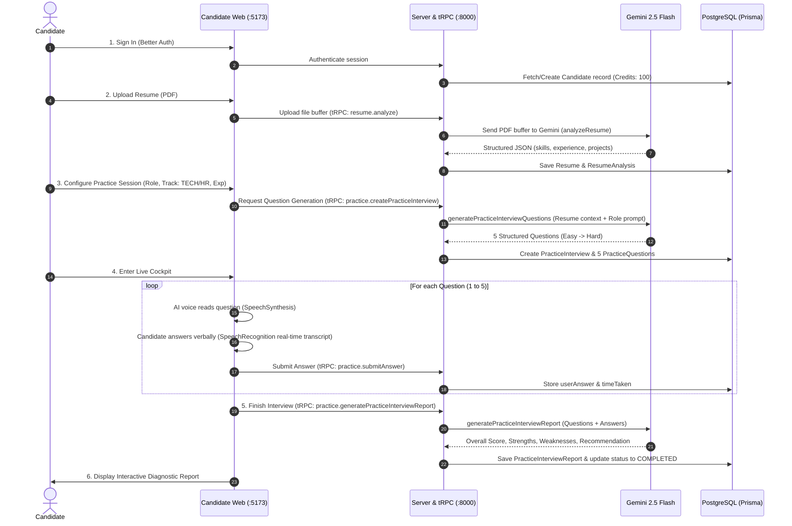
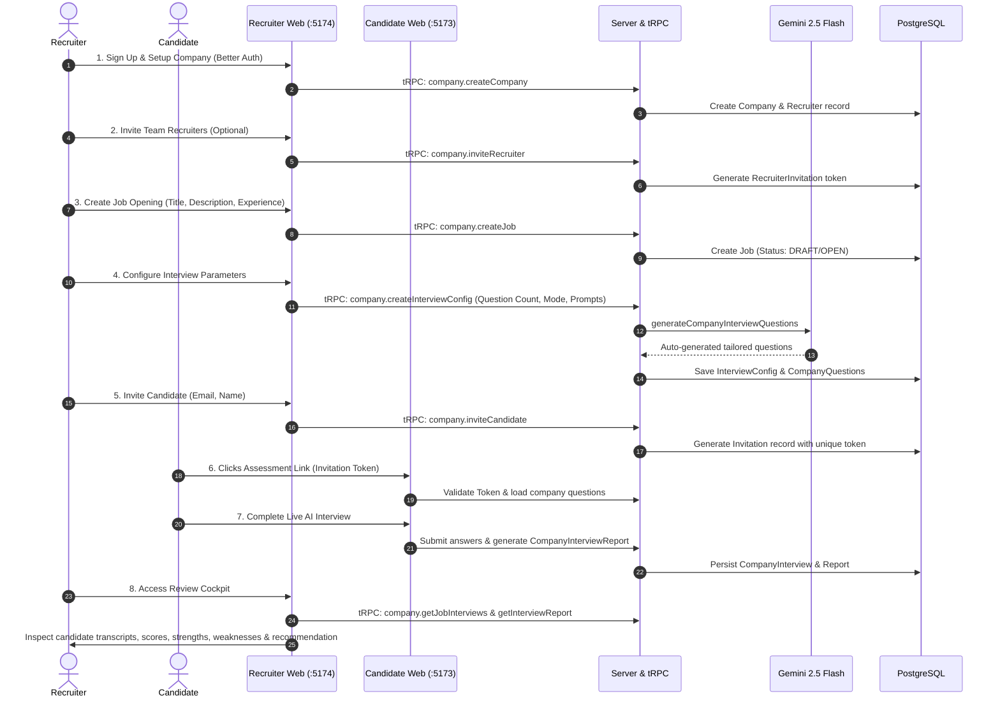
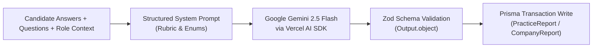

# High-Level Workflows & User Journeys

This document illustrates the operational journeys of **Candidates**, **Recruiters**, and the underlying **AI Evaluation Loop**.

---

## 1. Candidate Practice Workflow

Candidates use `apps/candidate-web` to prepare for high-stakes technical and behavioral interviews.

### Key Stages of Candidate Practice:
1. **Resume Ingestion & Intelligence**:
   - Resumes in PDF format are processed multimodal-style by Gemini 2.5 Flash.
   - Outputs: Full contact summary, skills list, validated projects, work experience duration, and recommended roles.
2. **5-Stage Curriculum Composition**:
   - **Q1 (EASY)**: Introduction & Background Overview.
   - **Q2 (EASY)**: Core Stack Competency (Tech) or Communication (HR).
   - **Q3 (MEDIUM)**: Practical Project Deep Dive (Tech) or Behavioral Scenarios (HR).
   - **Q4 (MEDIUM)**: Problem Solving & Troubleshooting (Tech) or Situational Judgment (HR).
   - **Q5 (HARD)**: System Scalability & Architectural Tradeoffs (Tech) or Cultural Alignment (HR).
3. **Cockpit Execution**:
   - Circular countdown timer with per-question limits (default 60s).
   - Speech synthesis for audio delivery paired with an AI video avatar.
   - Live speech recognition capturing candidate transcripts in real time.
4. **Diagnostic Feedback**:
   - Overall score (0–100).
   - Communication, Confidence, and Correctness sub-scores.
   - Bulleted list of candidate strengths, specific weaknesses, and actionable recommendations.

---

## 2. Recruiter Hiring Campaign Workflow

Recruiters use `apps/recruiter-web` to streamline technical and behavioral candidate assessments.

---

## 3. AI Evaluation & Scoring Pipeline

The server's AI service (`packages/api/src/services/ai.service.ts`) executes a deterministic, schema-enforced pipeline:

### Scoring Dimensions:
- **Correctness Score (0–100)**: Accuracy of technical claims, algorithmic soundness, and domain competence.
- **Communication Score (0–100)**: Articulation, structure (e.g., STAR method), conciseness, and verbal clarity.
- **Confidence Score (0–100)**: Decisiveness, tone consistency, and response readiness under time constraints.
- **Overall Score**: Weighted composite index reflecting role suitability.
